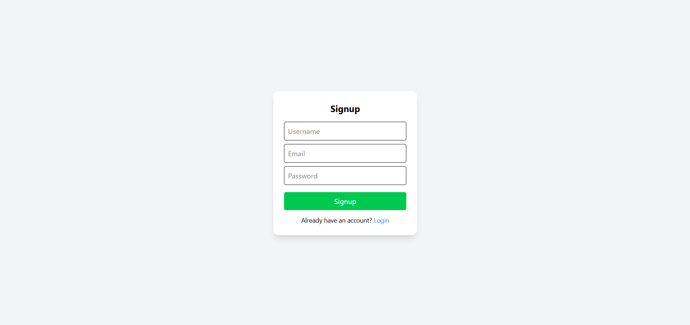
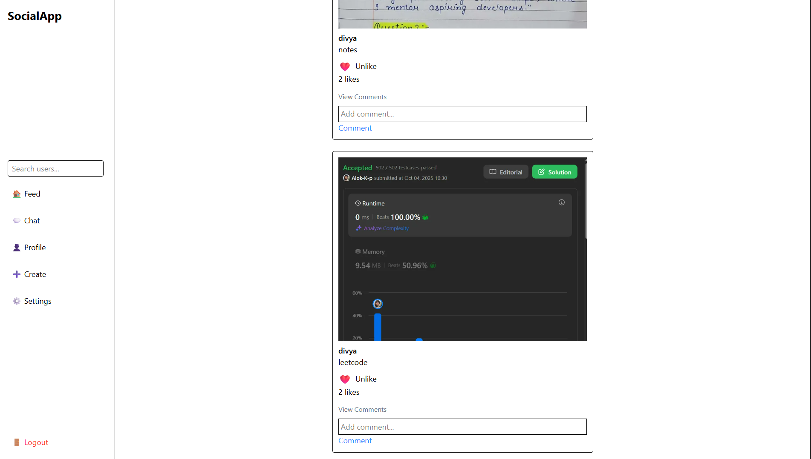
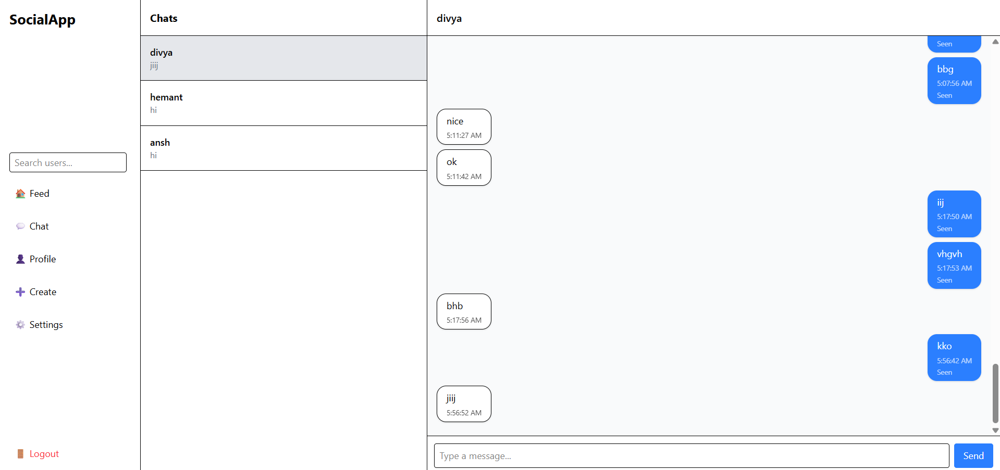
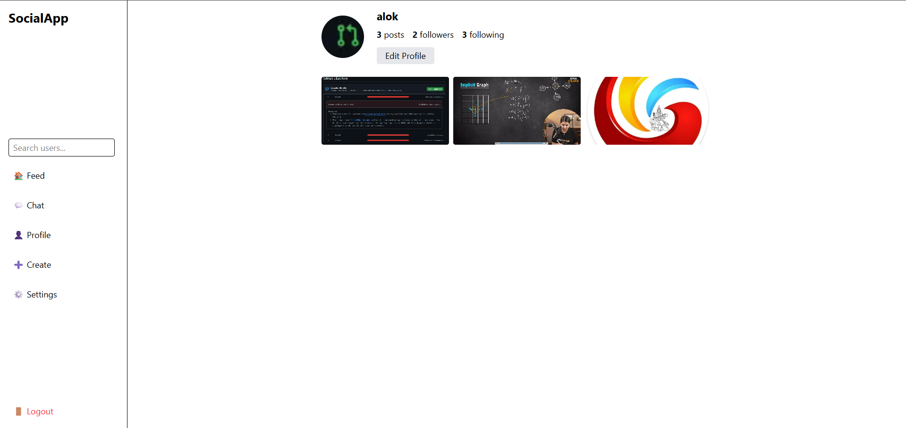

# 🚀 SocialApp — Real-Time Social Media Platform

A full-stack **real-time social media application** built with modern technologies, featuring messaging, feeds, and scalable backend architecture.

---

## 🔗 Live Demo

[LIVE LINK](https://social-media-eight-brown.vercel.app/signup)

---

## 🖼️ Screenshots

### 🔐 Signup Page


### 🏠 Feed


### 💬 Chat (Real-Time)


### 👤 Profile


---

## 📌 Overview

**SocialApp** is a production-ready social media platform that enables users to:

* 🔐 Authenticate securely
* 📝 Create and interact with posts
* ❤️ Like, comment, and follow users
* 💬 Chat in real-time (WebSocket-based)
* 📡 Experience real-time updates using Redis

---

## 🛠️ Tech Stack

### 🔙 Backend

* **FastAPI** — High-performance Python backend
* **PostgreSQL** — Relational database
* **Alembic** — Database migrations
* **Redis** — Pub/Sub for real-time messaging

### 🎨 Frontend

* **React (Vite)** — Modern frontend framework
* **Axios** — API communication
* **WebSockets** — Real-time chat

### ☁️ Cloud & Services

* **ImageKit** — Image storage & CDN for feeds
* **Render** — Backend hosting
* **Vercel** — Frontend deployment
* **Upstash Redis** — Cloud Redis service

---

## ⚡ Features

* 🔐 JWT Authentication
* 👥 Follow / Unfollow system
* 🚫 Block users
* 📝 Create, like, comment on posts
* 💬 Real-time chat (WebSockets + Redis Pub/Sub)
* 🟢 Typing & seen indicators
* 📡 Scalable event-driven architecture

---

## 🧠 System Design Highlights

* Real-time communication using **WebSockets + Redis Pub/Sub**
* Decoupled frontend & backend architecture
* Production-ready deployment with environment-based configs
* Optimized for scalability and concurrency

---

## 📁 Project Structure

```bash
social_media/
│
├── backend/
│   ├── alembic/              # DB migrations
│   ├── app/
│   │   ├── api/              # API routes
│   │   ├── core/             # Config, security, Redis
│   │   ├── db/               # Database setup
│   │   ├── models/           # SQLAlchemy models
│   │   ├── schemas/          # Pydantic schemas
│   │   ├── services/         # Business logic
│   │   ├── websocket/        # Chat + Redis listener
│   │   └── main.py           # Entry point
│   ├── alembic.ini
│   └── requirements.txt
│
├── frontend/
│   ├── src/
│   │   ├── api/
│   │   ├── components/
│   │   ├── context/
│   │   ├── pages/
│   │   └── utils/            
│   │   └── websocket/            
│   │   └── App.jsx         
│   │   └── main.jsx            
│   └── package.json
│
├── screenshots/              # App screenshots
├── .env.example             # Sample environment variables
├── .gitignore
└── README.md
```

---

## 🖼️ Screenshots

All UI screenshots are available inside the `screenshots/` folder.

---

## ⚙️ Environment Variables

### Backend

```
DATABASE_URL=...
REDIS_URL=...
SECRET_KEY=...
IMAGEKIT_PUBLIC_KEY=...
IMAGEKIT_PRIVATE_KEY=...
```

### Frontend

```
VITE_API_URL=...
VITE_WS_URL=...
```

---

## 🚀 Running Locally

### Backend

```bash
cd backend
pip install -r requirements.txt
alembic upgrade head
uvicorn app.main:app --reload
```

---

### Frontend

```bash
cd frontend
npm install
npm run dev
```

### Other Strong Options:

* Full Stack Social Media App with Real-Time Chat
* Scalable Social Networking Platform (FastAPI + React)
* Distributed Real-Time Chat & Social Platform

---

## 🧠 Key Learning Outcomes

* Designing scalable real-time systems
* Handling async + WebSocket architecture
* Using Redis for distributed messaging
* Deploying full-stack apps in production

---

## 👨‍💻 Author

**Alok**
Aspiring Software Engineer | Backend & AI Enthusiast

---

## ⭐ If you like this project

Give it a ⭐ on GitHub and feel free to fork or contribute!
